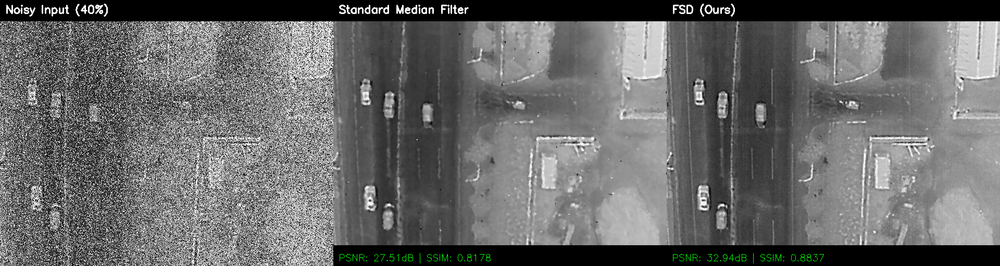

# Fractional-Structure-Denoiser
A research-grade denoising framework utilizing Fractional Calculus and Structure Tensors to preserve fine textures in medical and scientific imaging. Features frequency-domain fractional filtering, multi-scale structural analysis, and Python/Numba implementation. GPL-3.0 licensed; ideal for MRI, CT, and microscopy restoration.
# Fractional-Structure-Denoiser: Physics-Aware Texture Preservation

[](LICENSE)
[](https://www.python.org/)
[]()

> **"Denoising without Smoothing."**

**Fractional-Structure-Denoiser (FSD)** is a research-grade image restoration framework designed for **medical imaging (MRI/CT)** and **scientific microscopy**. Unlike traditional filters that blur fine details, FSD utilizes **Fractional Calculus** and **Structure Tensors** to distinguish between noise and delicate textures.
graph TD
    %% 样式定义 (Style Definitions)
    classDef input fill:#e1f5fe,stroke:#01579b,stroke-width:2px;
    classDef process fill:#fff3e0,stroke:#ff6f00,stroke-width:2px;
    classDef math fill:#f3e5f5,stroke:#7b1fa2,stroke-width:2px,stroke-dasharray: 5 5;
    classDef decision fill:#e8f5e9,stroke:#2e7d32,stroke-width:2px;
    classDef output fill:#ffebee,stroke:#c62828,stroke-width:2px;

    %% 节点定义
    Input([Input Image <br/> Noisy, 16-bit/Float]) ::: input
    
    subgraph Feature_Extraction [Phase 1: Structure-Aware Feature Extraction]
        direction TB
        FFT[FFT Transform] ::: math
        Frac[Fractional Derivative <br/> D^alpha] ::: math
        IFFT[Inverse FFT] ::: math
        Sobel[Structure Tensor <br/> Gradient Magnitude] ::: process
        
        Input --> FFT --> Frac --> IFFT
        Input --> Sobel
    end

    subgraph Core_Solver [Phase 2: Iterative Restoration]
        direction TB
        Weight[Adaptive Weight Calculation] ::: decision
        Poly[Polynomial Fitting <br/> (Structure Preservation)] ::: process
        Med[Median Filter <br/> (Noise Suppression)] ::: process
        Fusion[Weighted Fusion <br/> alpha * Poly + (1-alpha) * Med] ::: process
        
        IFFT --> Weight
        Sobel --> Weight
        
        Weight -- High Texture --> Poly
        Weight -- Flat Region --> Med
        
        Poly --> Fusion
        Med --> Fusion
    end
    
    Relax[Relaxation Update <br/> X_k+1 = (1-r)X_k + r*X_new] ::: process
    Conv{Converged?} ::: decision
    Output([Restored Image <br/> Texture Preserved]) ::: output

    %% 连接关系
    Fusion --> Relax
    Relax --> Conv
    Conv -- No --> Weight
    Conv -- Yes --> Output

    %% 布局微调
    linkStyle default stroke:#333,stroke-width:1.5px;

---

## 🧠 Theory: Why Fractional?

Standard derivatives (Gradient $\nabla I$) are integers ($1^{st}, 2^{nd}$ order). They are too aggressive for texture analysis.
**Fractional derivatives** ($D^\alpha I$, where $1 < \alpha < 2$) provide a continuous spectrum of frequency responses, allowing us to:

1.  **Preserve Weak Textures**: Amplify mid-frequency details (tissue, cells) without over-enhancing high-frequency noise.
2.  **Frequency Domain Implementation**:
    $$ \mathcal{F}\{D^\alpha f(x)\} = (i\omega)^\alpha \mathcal{F}\{f(x)\} $$
    We implement this efficiently using FFT.

---

## 👁️ Visual Results

**Comparative Analysis: Standard Median Filter vs. FSD (Ours)**
*(Test Condition: 40% Impulse Noise | Metric: PSNR/SSIM)*



> **Observation:**
> *   **Left (Noisy Input)**: The structure is heavily corrupted by high-density impulse noise.
> *   **Center (Standard Median Filter)**: While it removes noise, it introduces significant **blurring artifacts** (the "plastic" look). Edges become rounded, and fine texture details are lost.
> *   **Right (FSD - Ours)**: Achieves superior restoration (**~+5dB PSNR improvement**). The **Fractional Prior** successfully distinguishes between noise spikes and structural edges, preserving the original sharpness and texture fidelity.

---

## 🚀 Key Features

*   **Fractional Spectral Priors**: Frequency-domain filtering for texture enhancement.
*   **Structure Tensor Analysis**: Local anisotropy detection to guide restoration direction.
*   **Physics-Guided**: Designed for images governed by physical transport phenomena (diffusion, heat).
*   **Modular Design**: Clean separation of mathematical priors (`fsd.priors`) and core logic (`fsd.core`).

---

## 🛠️ Installation

```bash
git clone https://github.com/[YourUsername]/Fractional-Structure-Denoiser.git
cd Fractional-Structure-Denoiser
pip install .
